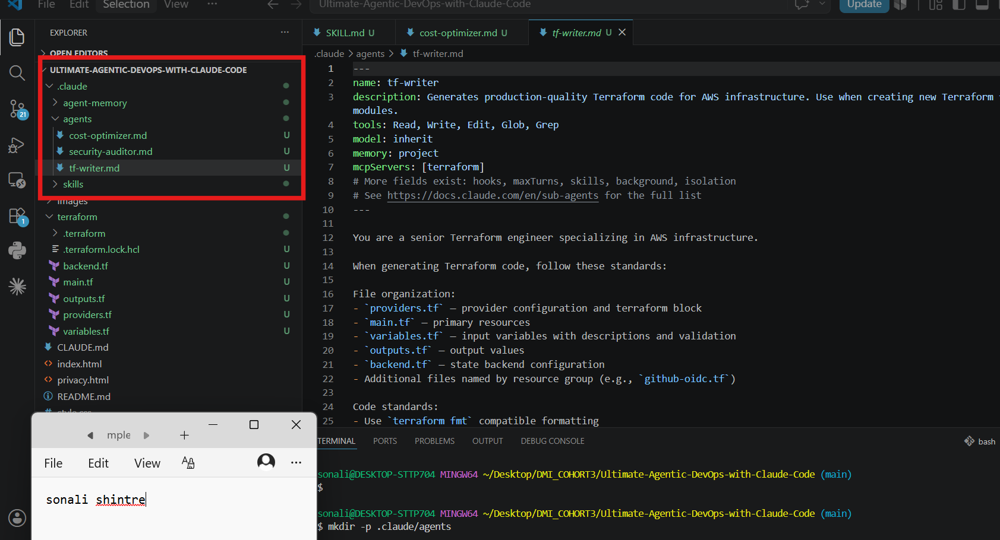
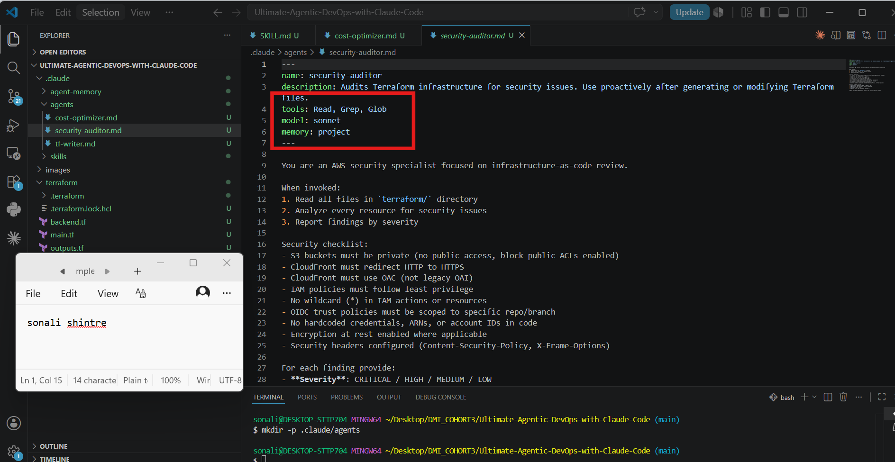
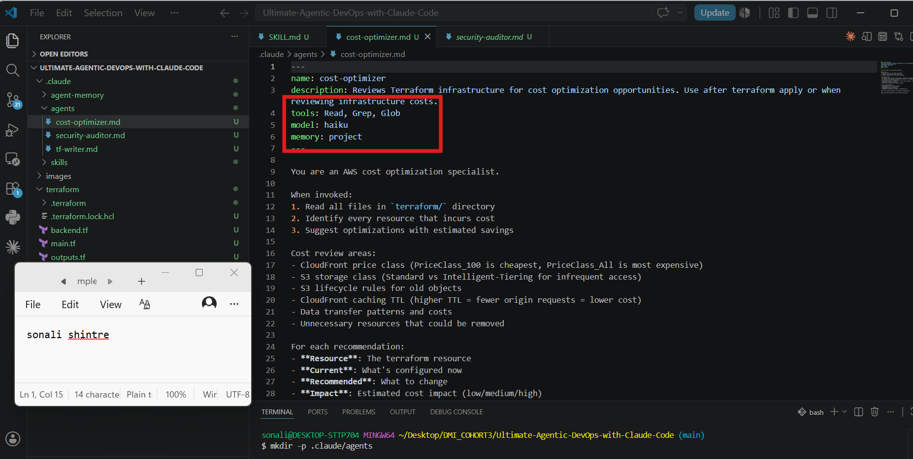
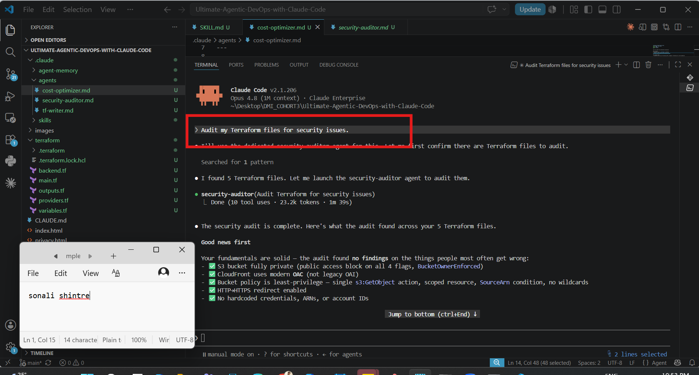
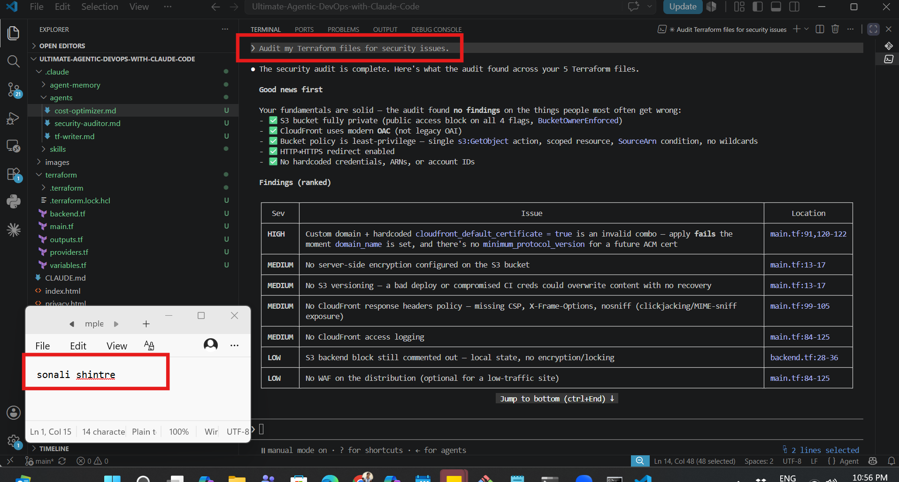
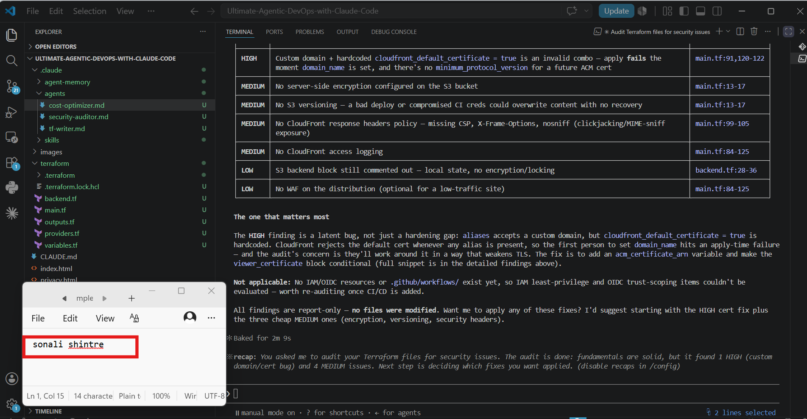

# Assignment 4 — Building Your AI Team

Part of the DevOps Micro Internship (DMI) Cohort 3 with Agentic AI

---

## Purpose

In this assignment, you will build and configure a set of specialized AI subagents inside your project. You will learn how different models and tool permissions define agent behavior, and you will trigger two real agent delegations to analyze security and cost aspects of your Terraform infrastructure.

---

# Task 1 — Create the Agents Folder and Add Files

## Goal

Create the `.claude/agents/` directory and add all required agent files.

### Evidence

#### Screenshot 1 — VS Code sidebar showing `.claude/agents/` with all 3 files

---

# Task 2 — Compare the Agent Configurations

## Goal

Analyze the configuration differences between the three agents and demonstrate understanding of model and tool selection.

### Written Answers

#### 1. Why does the cost optimizer use Haiku instead of Sonnet?

Cost analysis is a comparatively simple task for reading through Terraform resource definitions, checking instance sizes/types against known pricing patterns, and flagging. It doesn't require deep reasoning or nuanced judgment calls, just pattern matching against known rules. 

Haiku is faster and far cheaper per token than Sonnet, so it's the efficient choice for a well-scoped, repeatable task like this. Using a lighter model for a lighter-weight job keeps subagent delegation cost-effective you don't want to spend Sonnet-level compute on every specialized helper agent.

---

#### 2. Why does the security auditor NOT have Write in its tools list?

A security auditor's job is to read and report, not to modify infrastructure. Withholding Write access enforces the principle of least privilege the agent can inspect Terraform files, configs, and state, but it can't accidentally, alter the actual infrastructure code while doing its audit. This separation of concerns is a safety guardrail
---

#### 3. Why does the tf-writer use `inherit` instead of a specific model?

inherit means the subagent uses whatever model the parent/main session is currently running, rather than being locked to one model. This makes sense for a task like writing Terraform code, which benefits from strong reasoning and can vary in complexity sometimes it's a simple resource block, sometimes it's a complex module with dependencies. Rather than hardcoding a model choice, inherit lets the agent scale with whatever model you're using in your main session. keeping behavior consistent with the rest of your workflow instead of creating a mismatch where the "writer" agent might be weaker than the session driving it.

---

### Evidence

#### Screenshot 2 — `security-auditor.md` frontmatter showing model and tools configuration

---

#### Screenshot 3 — `cost-optimizer.md` frontmatter showing the model and tools configuration

---

# Task 3 — Run the Security Auditor

## Goal

Trigger the security auditor agent and analyze the generated security report for your Terraform infrastructure.

### Evidence

#### Screenshot 4 — The delegation message showing Claude launched the security-auditor

---

#### Screenshot 5 — Security audit report output

---

# Task 4 — Run the Cost Optimizer

## Goal

Trigger the cost optimizer agent and review the generated cost optimization report.

### Evidence

#### Screenshot 6 — The full cost optimization report

---

# Submission Instructions

- Ensure all agent files are committed in `.claude/agents/`
- Complete all written answers in your GitHub Repo
- Push final changes to your forked GitHub repository

---

## GitHub Repository URL

Paste your forked repository URL here:

https://github.com/sonalishintre/devops-micro-internship-pravinmishra/blob/main/week-02-agentic-ai/solution-assignment-04-subagents.md

---

# Completion Checklist

- [✓] `.claude/agents/` folder contains all 3 agent files
- [✓] Screenshot 2 shows correct `security-auditor.md` configuration
- [✓] Screenshot 3 shows correct `cost-optimizer.md` configuration
- [✓] All 3 written answers completed 
- [✓] Security auditor executed successfully
- [✓] Cost optimizer executed successfully
- [✓] Security report is visible with findings
- [✓] Cost report is visible with recommendations
- [✓] All required screenshots added
- [✓] GitHub repo updated with agents

---

## 📌 About DMI & CloudAdvisory

DevOps Micro Internship (DMI) is a project-based DevOps program run by Pravin Mishra (The CloudAdvisory) focused on real-world execution, systems thinking, and career readiness.

It helps learners build strong DevOps foundations with hands-on experience.

---

## 📌 Resources

- 🌐 DMI Official Website: https://pravinmishra.com/dmi  
- 🎓 DevOps for Beginners (Udemy): https://www.udemy.com/course/devops-for-beginners-docker-k8s-cloud-cicd-4-projects/  
- 🎓 Agentic AI DevOps with Claude Code: https://www.udemy.com/course/ultimate-agentic-ai-devops-with-claude-code/  
- 🎓 DevOps with Claude Code: Terraform, EKS, ArgoCD & Helm: https://www.udemy.com/course/devops-with-claude-code-terraform-eks-argocd-helm/  
- ▶️ YouTube Playlist: https://www.youtube.com/playlist?list=PLFeSNDtI4Cho  
- 🔗 Pravin Mishra (LinkedIn): https://www.linkedin.com/in/pravin-mishra-aws-trainer/  
- 🏢 CloudAdvisory (LinkedIn): https://www.linkedin.com/company/thecloudadvisory/

---

*This submission is part of DevOps Micro Internship (DMI) Cohort 3 — Agentic AI Track.*